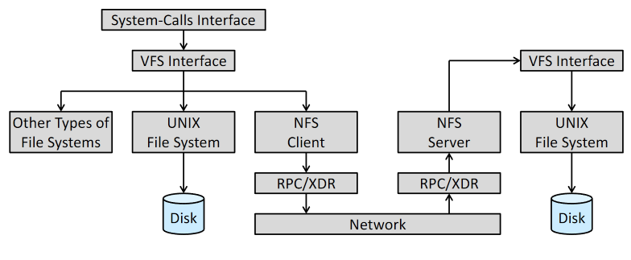

# File System

## File

- Attributes
  
  - name, id, type, location, size
  
  - protection (permission), timestamps, user identification

- Operations
  
  - create, open, read, write, seek, delete, truncate, close

- Open-file table & locks

## Access Methods

- Sequential

- Direct access / relative access

- Others
  
  - built on top of direct-access
  
  - e.g. indexed

## Directory Structure

- Single-level

- Two-level

- Tree

- Acyclic graph
  
  - When **links** exist

- General graph
  
  - Should carefully handle infinite loops

## Protection

- Different type of access

- Access control

## File System Structure

- IO between memory and storage are in units of **blocks**

- Layers
  
  - HW device
  
  - IO control
  
  - Basic file system (Linux block IO subsystem)
  
  - File-organization module
    
    - Files <-> logical blocks
    
    - Free space manager
  
  - Logical file system
    
    - Manages metadata, directory structure
    
    - Maintain inodes
  
  - Application programs

- Things in a file system
  
  - Boot control block
  
  - Volume control block
  
  - A directory structure that organizes the files
  
  - Per-file FCB

- Things in memory
  
  - Mount table
  
  - System open-file table
  
  - Process open-file table
  
  - Buffer

## Directory Implementation

- Linear list

- Hash table

## Allocation Methods

- Contiguous allocation
  
  - Easy to implement, serious external fragmentation
  
  - **Extent**: added to allow the file to grow

- Linked allocation
  
  - No external fragmentation, no compaction needed
  
  - Inefficient when seeking within a file
  
  - Additional space needed for pointers
  
  - Not quite reliable
  
  - **File-allocation table** (FAT)
    
    - A section of storage is dedicated for the "pointers"
    
    - Less direct-access time
    
    - For every block, an entry is needed

- Indexed allocation
  
  - Store all pointers on an index block
  
  - No external fragmentation, no compaction needed
  
  - More spaced needed than linked allocation
  
  - Multilevel index allows much larger file size

- Performance aspect
  
  - Sequential access and random access may favor different method
    
    - Linked allocation isn't suitable for random access
  
  - Indexed allocation can be more complex
  
  - Different hardware also needed different algorithms and tuning

## Free Space Management

- Bitmap
  
  - Simple
  
  - The bitmap/vector needs to be in memory for efficiency

- Linked list
  
  - No wasted space
  
  - Inefficient to traverse
    
    - But traversing isn't that frequent

- Grouping
  
  - Improved linked list
  
  - Stores multiple free block addresses in a node

- Counting
  
  - Each entry in the table consists of an address and a count of free contiguous blocks
  
  - Shorter list than naive method
  
  - Can be stored using BST for efficient operations

- Space maps
  
  - Used by zfs
  
  - Divide the space into "metaslabs"
  
  - A log of all block activities

- TRIM
  
  - The OS tells the device (SSD) that a page is no longer in use
  
  - Provides better writing performance and longer device life

## Performance & Efficiency

- Disk IO is the bottleneck in many cases

- Buffer cache: blocks that we think will be used again shortly

- Page cache: cache as virtual memory pages instead of blocks

- Unified buffer cache: one cache system for both mmap IO and fs IO to avoid double caching

- Synchronous vs Asynchronous writes

- Free-behind & read-ahead

## Recovery

- Consistency checking

- Log-based transaction-oriented (journaling) file system
  
  - Metadata changes are written to a log
  
  - Log entries are replayed to complete IO
  
  - All transactions must be completed when the system crashes

- Snapshot

- Backup

## Mounting

- Some implementation options
  
  - Allow / disallow mounting to an non-empty directory
  
  - Allow / Disallow multiple mounts per file system

## Virtual File Systems

- An interface for file-system-generic operations

- A mechanism to uniquely represent a file throughout network

- Linux as example:
  
  - Object types
    
    - inode object: an individual file
    
    - file object: an open file
    
    - superblock object: an entire file system
    
    - dentry object: an individual directory
  
  - Some operations: `open()`, `close()`, `read()`, `write()`, `mmap()`

## Remote File Systems

- Client-server model
  
  - Security challenges

- Distributed information system
  
  - Provides information needed for remote computing
  
  - e.g. DNS, NIS, CIFS, LDAP

## Consistency Semantics

- Unix semantics
  
  - Writes are immediately visible to others opening the file
  
  - Allows sharing the pointer of current location
  
  - One physical image for a file

- Session semantics
  
  - Writes are not immediately visible to others opening the file
  
  - Changes made in a session are only visible to sessions started after it ends
  
  - Can be temporarily multiple images for a file

- Immutable-shared-files semantics
  
  - Content is fixed, filename can't be reused
  
  - Read only

## NFS

- Uses RPC

- Mount protocol
  
  - `mount` changes only the client side

- NFS protocol
  
  - Provides RPCs for remote file ops
  
  - Stateless in v3, stateful in v4

- Remote ops
  
  - Almost one-to-one correspondence to UNIX syscalls
  
  - Buffering, caching, read-ahead, and delayed-write are all used

