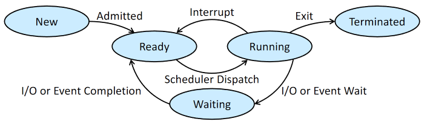

# Process

## Concept

- Memory layout
  
  - **Text**: the executable code
  
  - **Data**: global variables
  
  - **Heap**: dynamically allocated during run time
  
  - **Stack**: temporary data storage when invoking functions

- Process state
  
  - 

- Process control block
  
  - Process state, number
  
  - Program counter, CPU registers
  
  - Scheduling information: priority, queue pointers, etc.
  
  - Memory management information
  
  - Accounting information
  
  - IO status information

## Scheduling

- Multiprogramming: to have some process running at all times and maximize CPU utilization

- Time sharing: to switch between processes so frequently that users can interact with each program while it's running

- **Degree of multiprogramming**: number of processes currently in memory

- Scheduling queues:
  
  - Ready queue
  
  - Wait queue
  
  - Stored as a linked list

- Context switch
  
  - Switch from one process to another on a CPU core
  
  - Save current state of the process to its PCB. Restore saved state of another.
  
  - Context switch time is pure overhead
  
  - Switching speed depends on:
    
    - Memory speed
    
    - Number of registers
    
    - Special instructions & HW support

## Operations on Processes

- Creation
  
  - A parent process creates child processes
  
  - Resource sharing options: all / subset / none
  
  - Execution options: concurrently / wait child
  
  - Address space options: duplicate / new

- Termination
  
  - Ask the OS to delete it using `exit()`
  
  - A parent may terminate its children
    
    - **Cascading termination**: if a process terminates, then all its children must also be terminated.
  
  - **Zombie**: a process has terminated, but its parent hasn't called `wait()`
    
    - Its entry in process table isn't removed until `wait()`
  
  - **Orphan**: a process that its parent terminates before calling `wait()`

## Interprocess Communication

- Producer-consumer problem
  
  - A producer process produces information for a consumer process

- Shared memory
  
  - Generally faster
  
  - Solutions
    
    - A buffer of items that can be filled by the producer, and emptied by the consumer
    
    - Synchronize the producer and the consumer

- Message passing
  
  - `send()` and `receive()`
  
  - Easier to implement in distributed systems
  
  - Can be fixed or variable size
  
  - The "link" can be implemented in many ways, including shared memory
  
  - **Direct communication**: explicitly name the recipient/sender
    
    - Limited modularity
  
  - **Indirect communication**: using a "mailbox"
    
    - Mailbox can be owned by a process or the OS
  
  - Synchronization
    
    - Synchronous(blocking) vs Asynchronous(non-blocking)
      
      - `send()` and `receive()` can be different
      
      - When both are blocking, we have a **rendezvous**
