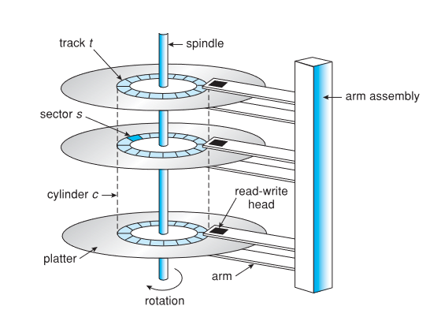

# Storage

## Overview

- HDD
  
  
  
  - Positioning time (access time) = seek time (to cylinder) + rational latency (to sector)
  
  - IO time = access time + transfer time + controller overhead

- NVM (Nonvolatile Memory)
  
  - More reliable, faster, less power consumption
  
  - Higher price per byte, less capacity per device

## HDD Scheduling

- FCFS

- SCAN
  
  - Aka the elevator algorithm
  
  - Starts at one end, then move to the other end

- C-SCAN
  
  - Treat the cylinders as a circular list, serve none on returning

- Linux uses a deadline scheduler to avoid starvation

## NVM Scheduling

- No moving RW head, therefore FCFS is commonly used

- Random IO is much faster

- Write amplification can impact writing performance

## Error Detection and Correction

- Checksums

- CRC

- ECC

## Device Management

- Clusters (group of blocks) are used by filesystems to do fs IO

- Bad blocks
  
  - Sector sparing: controller translates the bad address to another
  
  - Sector slipping: don't map logical sectors to bad physical sectors

## Storage Attachment

- NAS: file-based IO

- Cloud Storage: API-based IO

- Storage Area Network: block-based IO

## RAID

- Reliability via redundancy

- Performance via parallelism
  
  - Data striping and block striping

- Snapshots, replication, hot spares
